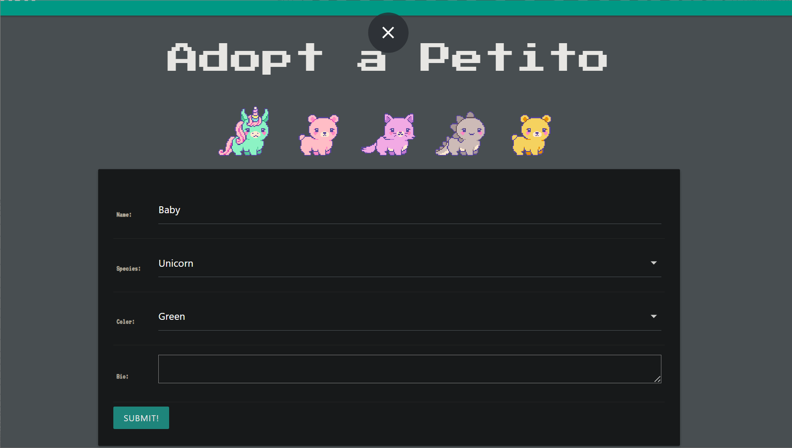
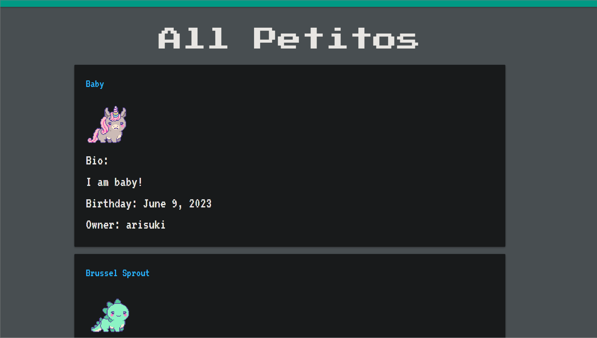

# 1. Intro to Petito
Petito is an electronic pet CRUD Django APP. Users can create pixel pets, which they can name and care for in various ways. 

# 2. Screenshots of Petito: 

# 3. Technologies Used: 
Python, Django, AWS s3, Aseprite, Javascript, HTML, CSS, Materialize, PostgreSQL, Neon

# 4. Getting Started with Petito: 

    Link to Deployed App: TBD

    Link to Project's Trello Board: https://trello.com/b/n0wphGHe/project-3-sei

    Link to Wireframes: https://balsamiq.cloud/sjh802t/ppp4vkz/r2278

    Link to ERD: see Trello board.

# 5. Next Steps / Ice-Box Items: 

Idea for next phases of development:
-Set maximum number of pets. 
-Happiness/Health meter for pets. 
-See other users' pets. 
-Persistent currency that accumulates to buy stuff for your pets.
-Be able to trade pets with other users. 
-Play games with your pets. 
-Premium experience - buy accessories for your pet.
-Rare paint colors, species, etc.
-Sell app. 

